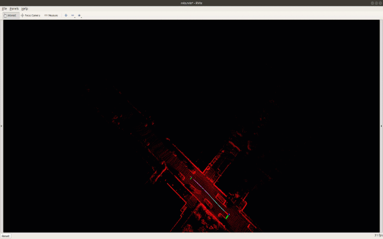
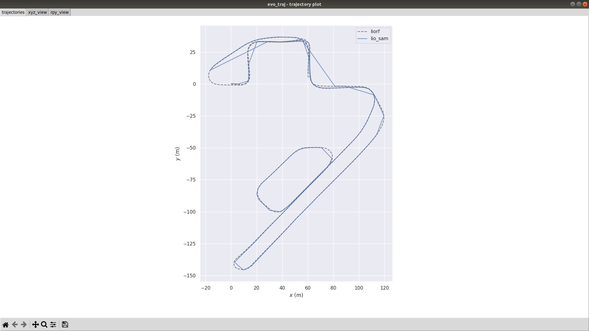
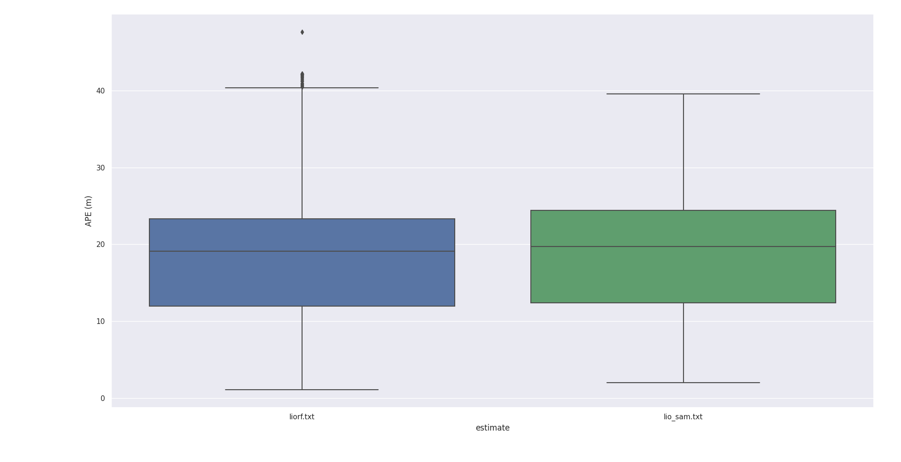
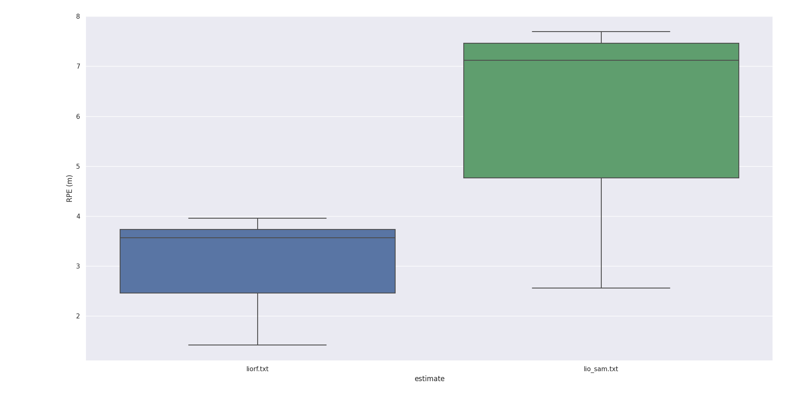
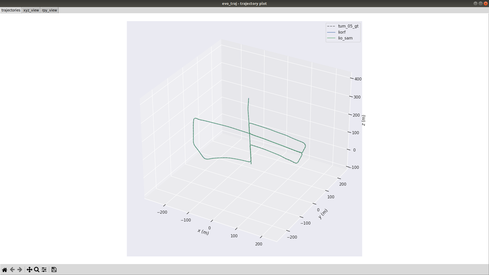
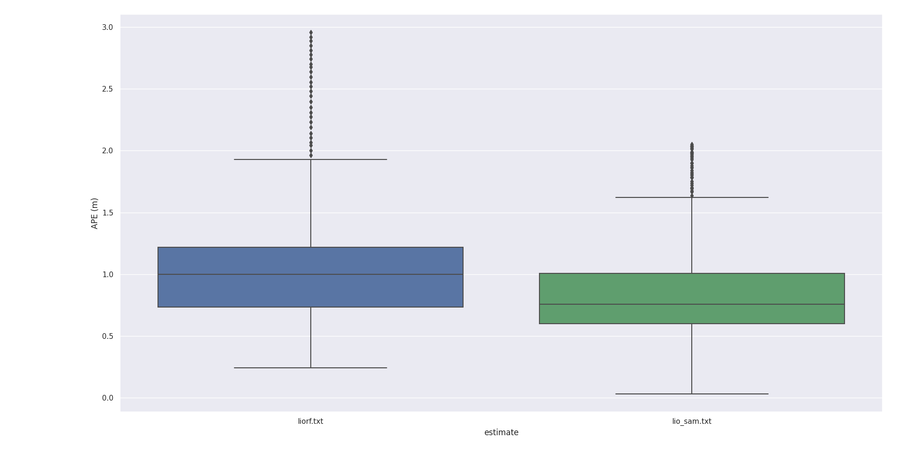
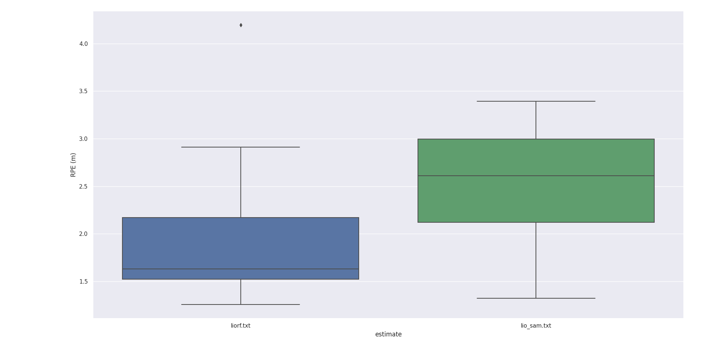

# New Feature
------------------- Update Date: 2022-11-20 -------------------
- This version has removed the feature extraction module, making it easier to adapt to different lidars;
  
- Support 'robosense' lidar and Mulran datasets, make the following changes in "*.yaml":
  - sensor: “robosense” or sensor: “mulran”

- Support 6-axis IMU, make the following changes in "*.yaml":
  - imuType: 0 # 0: 6-axis IMU, 1: 9-axis IMU

- Support low frequency IMU（50HZ、100HZ）, make the following changes in "*.yaml":
  - imuRate: 500

------------------- Update Date: 2022-12-13 -------------------
- Re-derivation the LM optimization, don't need coordinate transformation.

------------------- Update Date: 2022-12-24 -------------------
- Modified gps factor, no longer depending on the 'robot_localization' package, and make it easier to adapt to different gnss device(RTK/GPS).

- The gps factor is modified to make it easier to adapt to gnss devices with different frequencies(10HZ~500HZ).

------------------- Update Date: 2023-02-11 -------------------
- Add scancontext loop closure detection;

- Support M2DGR dataset.

------------------- Update Date: 2024-04-29 -------------------
- Add [liorf ROS2](https://github.com/YJZLuckyBoy/liorf/tree/liorf-ros2) version (Foxy、Galactic).

Blog：[LIO-SAM：配置环境、安装测试、适配自己采集数据集](https://blog.csdn.net/qq_42938987/article/details/108434290)

Video：[基于LIO-SAM框架SLAM算法开发系列视频](https://space.bilibili.com/327643131/channel/collectiondetail?sid=945184&ctype=0)

## Dependency
- [gtsam](https://gtsam.org/get_started/)(Georgia Tech Smoothing and Mapping library)
  ```
    sudo add-apt-repository ppa:borglab/gtsam-release-4.0
    sudo apt install libgtsam-dev libgtsam-unstable-dev
  ```
- Others
  ```
    sudo apt install libgeographic-dev
  ```

## Install
1. Use the following commands to download and compile the package.
  ```
    mkdir -p ~/liorf-ros2/src && cd ~/liorf-ros2/src
    git clone https://github.com/YJZLuckyBoy/liorf.git
    cd liorf && git checkout liorf-ros2
    cd ../../
    colcon build
  ```

## Run the package
1. Run the launch file
  ```
    source install/setup.bash
    ros2 launch liorf run_lio_sam_default.launch.py
  ```

2. Play existing bag files. Example data in ROS2 format can be downloaded here ([lio-sam-dataset with ros2 format](https://drive.google.com/drive/folders/1n2AZC7GPpUMoW0K4nFGOI6vVjQcuxPru?usp=sharing))
  ```
    ros2 bag play casual_walk/
  ```

## For fusion gps factor
- Make sure your gnss topic type is 'sensor_msgs::msg::NavSatFix';

- Modify 'gpsTopic' paramter in '*.yaml' with yourself gnss topic;
  ```
    gpsTopic: "gps/fix"    # GPS topic
  ```
- If you want to use liorf with integrated gps factor in kitti dataset, you can use the modified python script in "config/doc/kitti2bag" to obtain high-frequency gps data(Rate: 100HZ, Topic: '/gps/fix/correct'). About how to use "[kitti2bag.py](https://github.com/YJZLuckyBoy/liorf/blob/main/config/doc/kitti2bag/kitti2bag.py)", please refer to [doc/kitti2bag](https://github.com/TixiaoShan/LIO-SAM/tree/master/config/doc/kitti2bag). 
This will generate a BAG package in ROS1 format, You need to convert it to the BAG package in ROS2 format, Please refer to the conversion method [ros2 to ros1](https://ternaris.gitlab.io/rosbags/index.html).

<!-- - For more details, please check the demo video: [基于LIO-SAM框架SLAM算法开发（六）：建图之快速适配多雷达及GNSS设备](https://www.bilibili.com/video/BV1ZD4y177ut/?spm_id_from=333.999.0.0&vd_source=fb7f82fee1e57e882c6174174ad2fa11) -->

## Mapping
  <!-- 1. lio-sam dataset
  <p align='center'>
      
  </p>

  2. M2DGR dataset
  <p align='center'>
      
  </p>

  3. kitti-05 dataset
  <p align='center'>
      
  </p>

  4. ubran_hongkong dataset
  <p align='center'>
      
  </p>

  5. MulRan dataset
  <p align='center'>
      
      
  </p>

  6. Multiple Lidar
  <p align='center'>
      
      
  </p>

  6. r3live dataset
  <p align='center'>
      
      
      
  </p> -->

## Performance
  <!-- 1. MulRan
  <p align='center'>
      
  </p>

  2. Kitti 01
  <p align='center'>
      
  </p>
  <p align='center'>
      
      
  </p>

  3. Kitti 05
  <p align='center'>
      
  </p>
  <p align='center'>
      
      
  </p> -->

## Acknowledgments
  Thanks for [LIO-SAM](https://github.com/TixiaoShan/LIO-SAM), [FAST_LIO2](https://github.com/hku-mars/FAST_LIO), [UrbanNavDataset](https://github.com/weisongwen/UrbanNavDataset), [M2DGR](https://github.com/SJTU-ViSYS/M2DGR) and [MulRanDataset](https://sites.google.com/view/mulran-pr/?pli=1).
